# Wallpapers

...for those in need of change

## Note

This is my personal collection, some are edited, some arent, some stolen.
I'll add more as time goes by. If you want to add some of your own and if I'd use them myself, it'll be added.

## Structure

Wallpapers are organised by a rough categorization, here's a few previews per directory:

### ascii

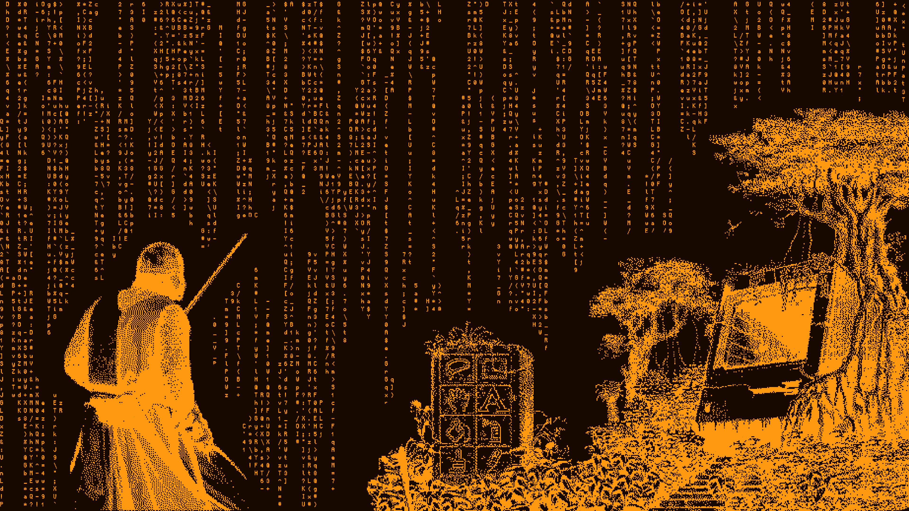

### digital

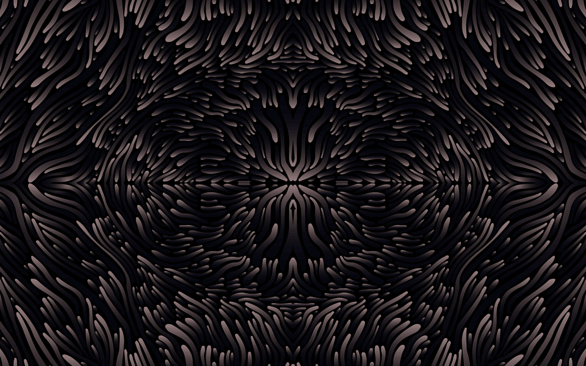

### linux

### minimalist

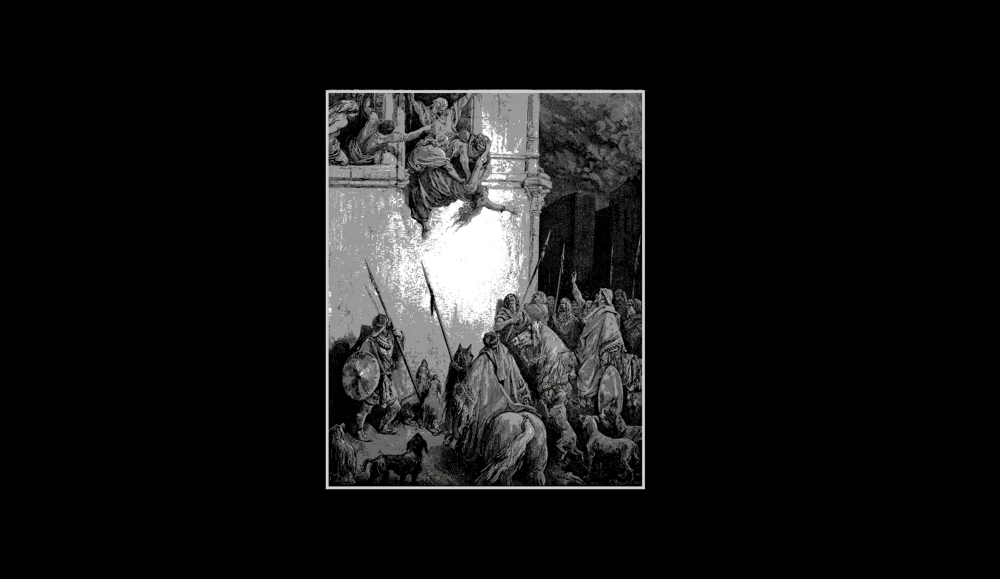

### nature

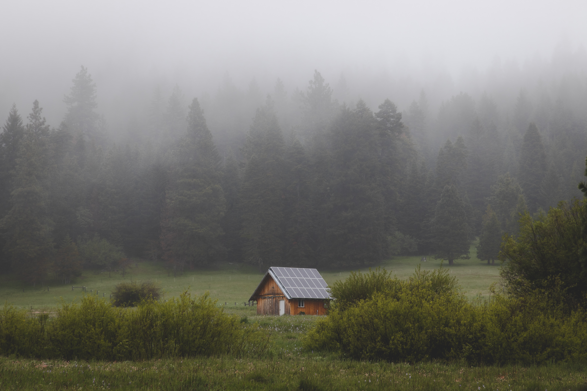
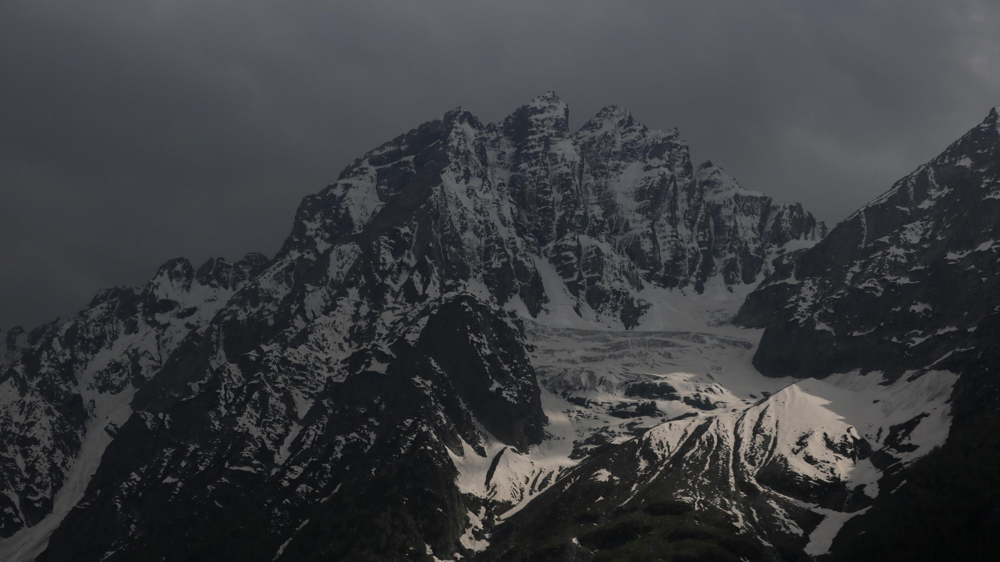

### paintings

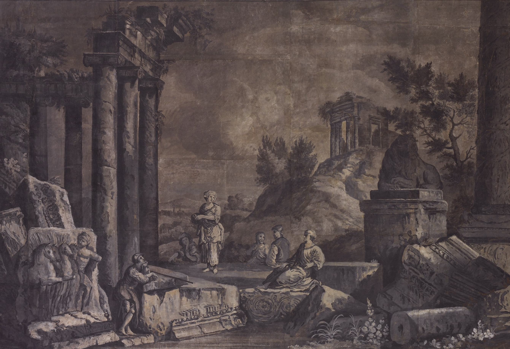
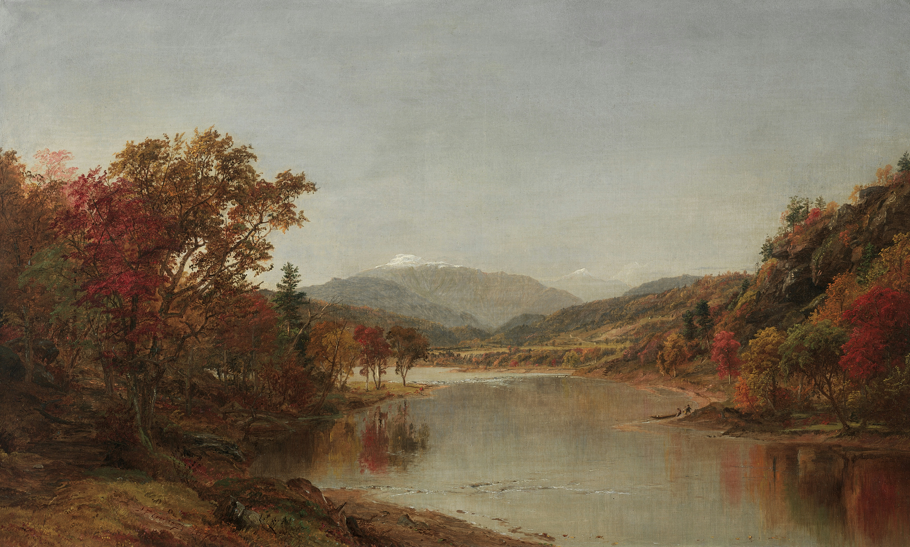
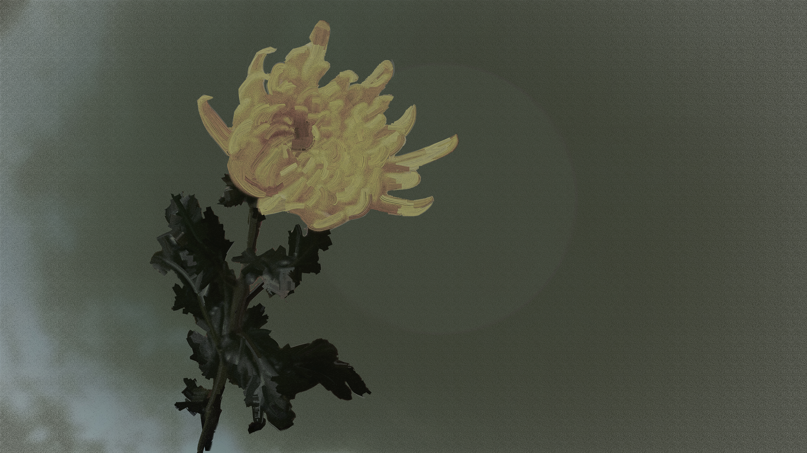

### plain

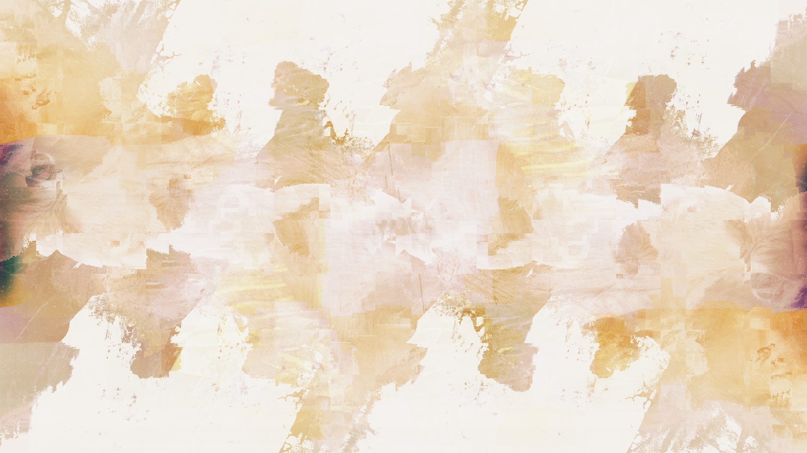
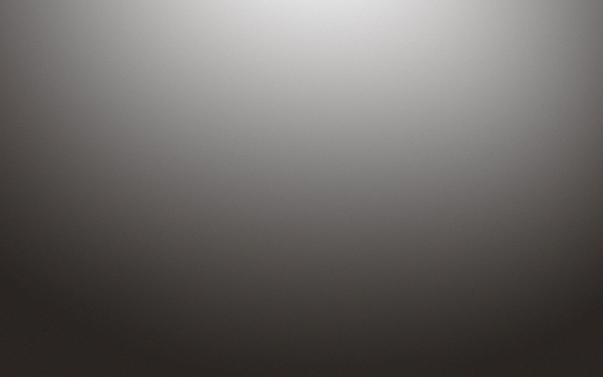
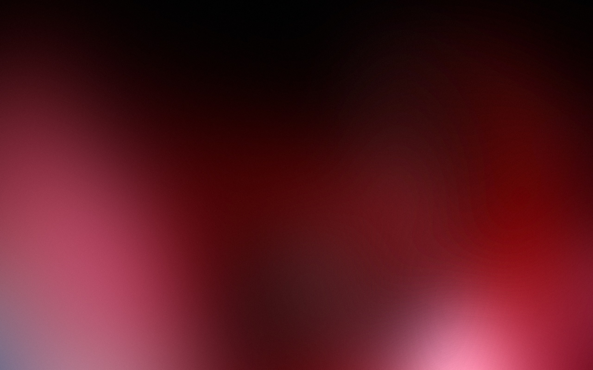

### videogame

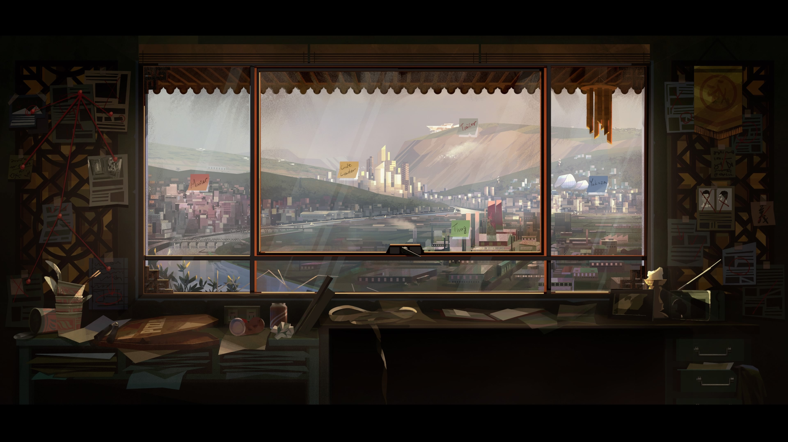
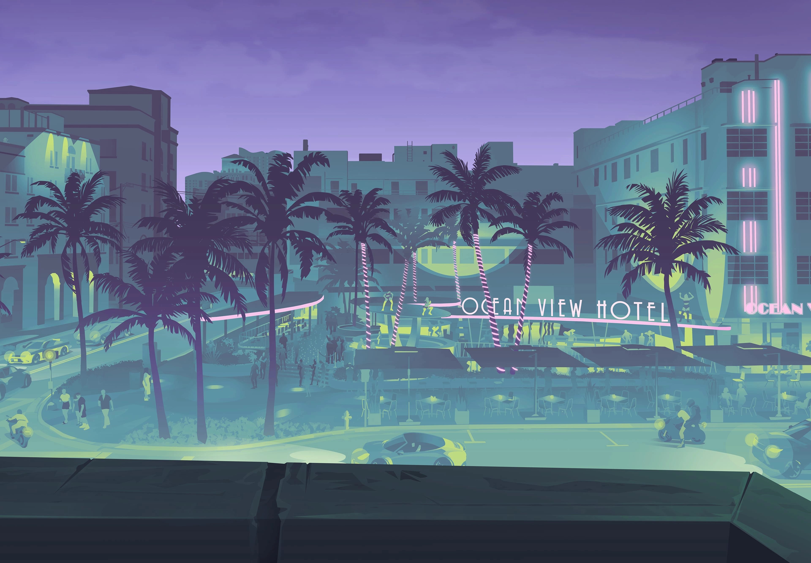

### yaga

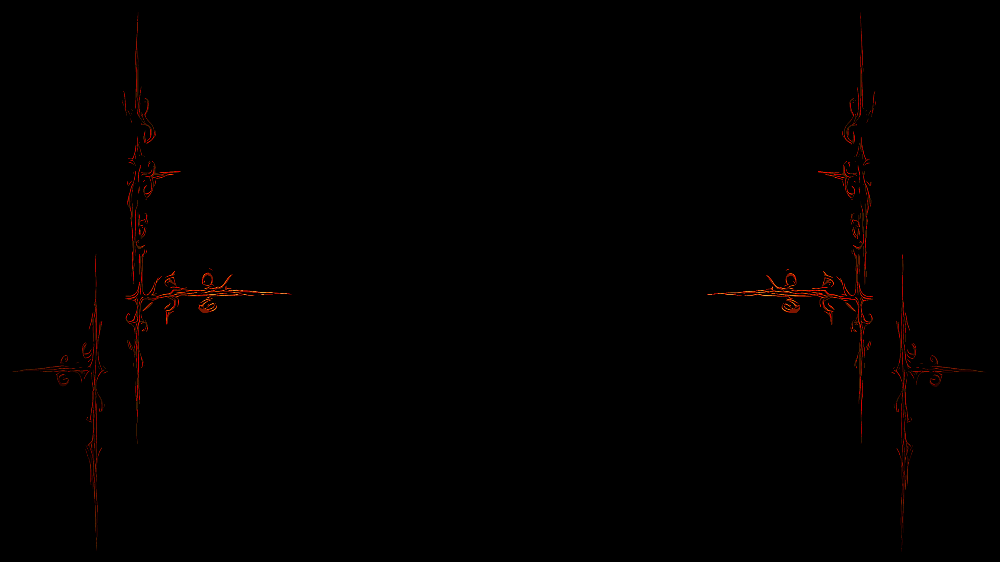
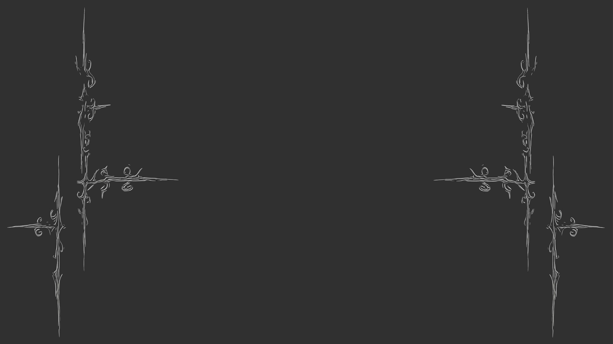
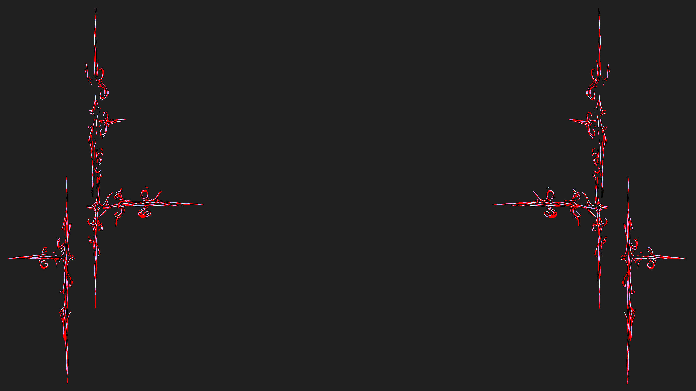
